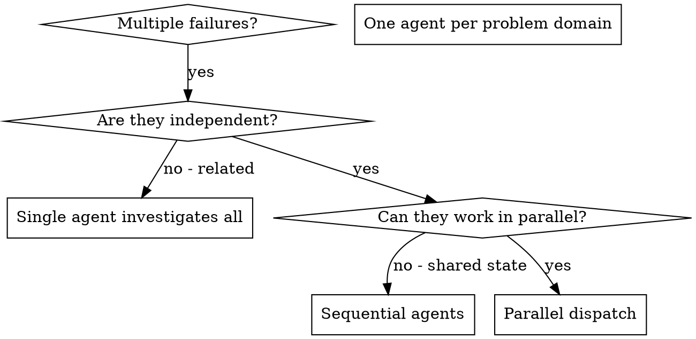

# Dispatching Parallel Agents

## Overview

When you have multiple unrelated failures (different test files, different subsystems, different bugs), investigating them sequentially wastes time. Each investigation is independent and can happen in parallel.

**Core principle:** Dispatch one agent per independent problem domain. Let them work concurrently.

## When to Use



**Use when:**
- 3+ test files failing with different root causes
- Multiple subsystems broken independently
- Each problem can be understood without context from others
- No shared state between investigations

**Don't use when:**
- Failures are related (fix one might fix others)
- Need to understand full system state
- Agents would interfere with each other (editing same files)

## The Pattern

### 1. Identify Independent Domains

Group failures by what's broken:
- File A tests: Authentication flow
- File B tests: Data validation
- File C tests: API endpoints

Each domain is independent — fixing authentication doesn't affect API endpoint tests.

### 2. Create Focused Agent Tasks

Each agent gets:
- **Specific scope:** One test file or subsystem
- **Clear goal:** Make these tests pass
- **Constraints:** Don't change other code
- **Expected output:** Summary of what you found and fixed

### 3. Dispatch in Parallel

```python
# Using Claude Code's Task tool
Task("Fix test_auth.py failures")         # Agent 1
Task("Fix test_validation.py failures")   # Agent 2
Task("Fix test_api.py failures")          # Agent 3
# All three run concurrently
```

**Alternative:** For review tasks, consider using Agent Teams (TeamCreate) which provide built-in cross-validation and shared task lists.

### 4. Review and Integrate

When agents return:
- Read each summary
- Verify fixes don't conflict
- Run full test suite
- Integrate all changes

## Agent Prompt Structure

Good agent prompts are:
1. **Focused** — One clear problem domain
2. **Self-contained** — All context needed to understand the problem
3. **Specific about output** — What should the agent return?

```markdown
Fix the 3 failing tests in tests/test_auth.py:

1. "test_login_with_expired_token" - expects 401, gets 200
2. "test_refresh_token_rotation" - token not rotated after use
3. "test_concurrent_sessions" - expects 3 sessions, gets 0

These may be timing or state issues. Your task:

1. Read the test file and understand what each test verifies
2. Identify root cause - timing issues or actual bugs?
3. Fix by addressing root cause (not just increasing timeouts)

Do NOT change tests in other files.

Return: Summary of what you found and what you fixed.
```

## Common Mistakes

**Too broad:** "Fix all the tests" — agent gets lost
**Specific:** "Fix tests/test_auth.py" — focused scope

**No context:** "Fix the race condition" — agent doesn't know where
**Context:** Paste the error messages and test names

**No constraints:** Agent might refactor everything
**Constraints:** "Do NOT change production code" or "Fix tests only"

**Vague output:** "Fix it" — you don't know what changed
**Specific:** "Return summary of root cause and changes"

## When NOT to Use

**Related failures:** Fixing one might fix others — investigate together first
**Need full context:** Understanding requires seeing entire system
**Exploratory debugging:** You don't know what's broken yet
**Shared state:** Agents would interfere (editing same files, using same resources)

## Verification

After agents return:
1. **Review each summary** — Understand what changed
2. **Check for conflicts** — Did agents edit same code?
3. **Run full suite** — Verify all fixes work together
4. **Spot check** — Agents can make systematic errors

## Key Benefits

1. **Parallelization** — Multiple investigations happen simultaneously
2. **Focus** — Each agent has narrow scope, less context to track
3. **Independence** — Agents don't interfere with each other
4. **Speed** — 3 problems solved in time of 1
