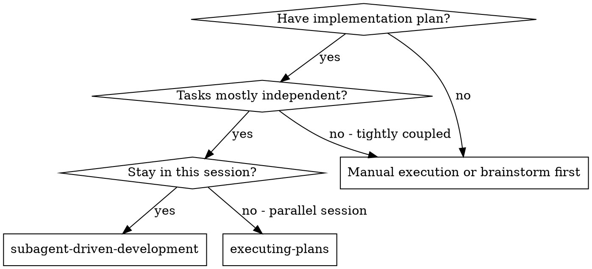
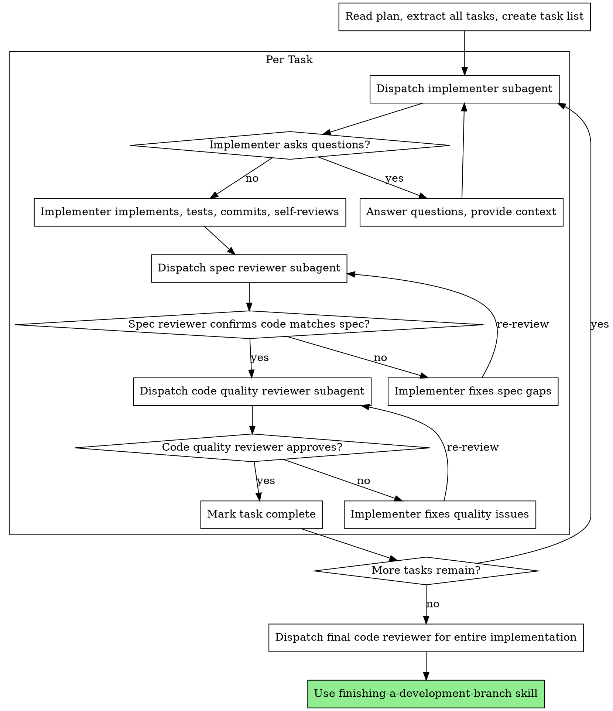

# Subagent-Driven Development

Execute plan by dispatching fresh subagent per task, with two-stage review after each: spec compliance review first, then code quality review.

**Core principle:** Fresh subagent per task + two-stage review (spec then quality) = high quality, fast iteration

## When to Use

**vs. Executing Plans (parallel session):**
- Same session (no context switch)
- Fresh subagent per task (no context pollution)
- Two-stage review after each task: spec compliance first, then code quality
- Faster iteration (no human-in-loop between tasks)

## The Process

## Prompt Templates

See the `references/` directory for dispatch templates:
- `implementer-prompt.md` — Dispatch implementer subagent
- `spec-reviewer-prompt.md` — Dispatch spec compliance reviewer subagent
- `code-quality-reviewer-prompt.md` — Dispatch code quality reviewer subagent

## Advantages

**vs. Manual execution:**
- Subagents follow TDD naturally
- Fresh context per task (no confusion)
- Parallel-safe (subagents don't interfere)
- Subagent can ask questions (before AND during work)

**vs. Executing Plans:**
- Same session (no handoff)
- Continuous progress (no waiting)
- Review checkpoints automatic

**Quality gates:**
- Self-review catches issues before handoff
- Two-stage review: spec compliance, then code quality
- Review loops ensure fixes actually work
- Spec compliance prevents over/under-building
- Code quality ensures implementation is well-built

## Red Flags

**Never:**
- Start implementation on main/master branch without explicit user consent
- Skip reviews (spec compliance OR code quality)
- Proceed with unfixed issues
- Dispatch multiple implementation subagents in parallel (conflicts)
- Make subagent read plan file (provide full text instead)
- Skip scene-setting context (subagent needs to understand where task fits)
- Ignore subagent questions (answer before letting them proceed)
- Accept "close enough" on spec compliance
- **Start code quality review before spec compliance is approved** (wrong order)
- Move to next task while either review has open issues

**If subagent asks questions:**
- Answer clearly and completely
- Provide additional context if needed
- Don't rush them into implementation

**If reviewer finds issues:**
- Implementer (same subagent) fixes them
- Reviewer reviews again
- Repeat until approved

## Integration

**Required workflow skills:**
- `requirements-framework:using-git-worktrees` — Set up isolated workspace before starting (recommended)
- `requirements-framework:writing-plans` — Creates the plan this skill executes
- `requirements-framework:requesting-code-review` — Code review template for reviewer subagents
- `requirements-framework:finishing-a-development-branch` — Complete development after all tasks

**Subagents should use:**
- `requirements-framework:test-driven-development` — Subagents follow TDD for each task

**Alternative workflow:**
- `requirements-framework:executing-plans` — Use for parallel session instead of same-session execution
