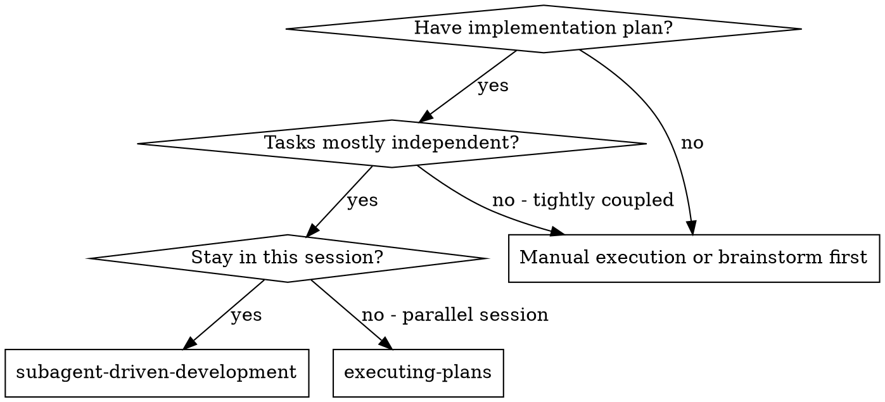
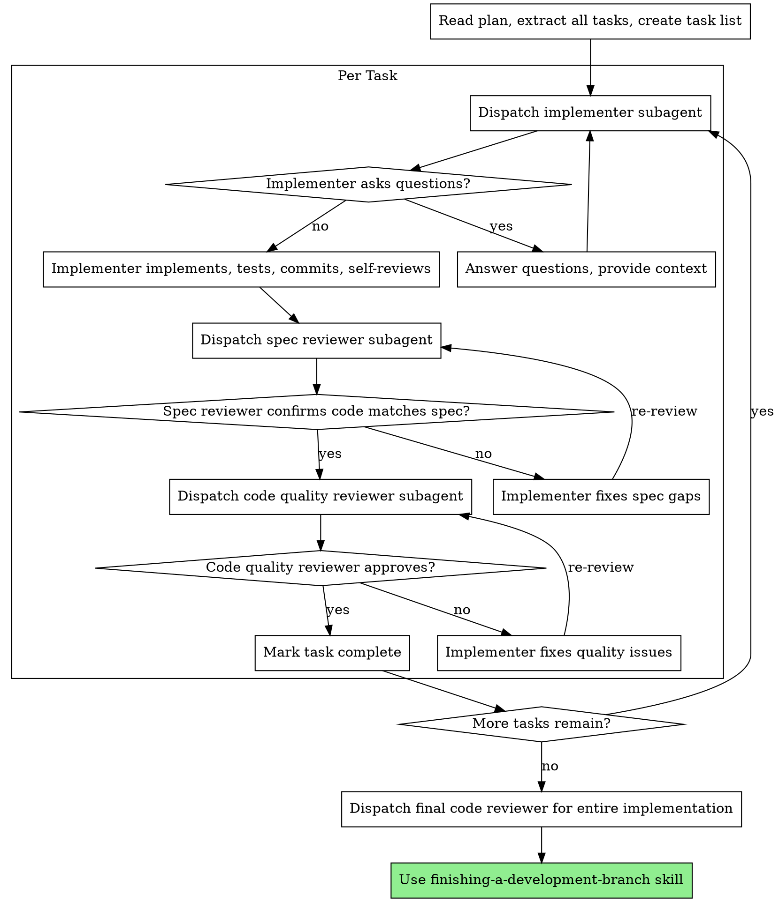

# Subagent-Driven Development

Execute plan by dispatching fresh subagent per task, with two-stage review after each: spec compliance review first, then code quality review.

**Core principle:** Fresh subagent per task + two-stage review (spec then quality) = high quality, fast iteration

## When to Use

```dot
digraph when_to_use {
    "Have implementation plan?" [shape=diamond];
    "Tasks mostly independent?" [shape=diamond];
    "Stay in this session?" [shape=diamond];
    "subagent-driven-development" [shape=box];
    "executing-plans" [shape=box];
    "Manual execution or brainstorm first" [shape=box];

    "Have implementation plan?" -> "Tasks mostly independent?" [label="yes"];
    "Have implementation plan?" -> "Manual execution or brainstorm first" [label="no"];
    "Tasks mostly independent?" -> "Stay in this session?" [label="yes"];
    "Tasks mostly independent?" -> "Manual execution or brainstorm first" [label="no - tightly coupled"];
    "Stay in this session?" -> "subagent-driven-development" [label="yes"];
    "Stay in this session?" -> "executing-plans" [label="no - parallel session"];
}
```

**vs. Executing Plans (parallel session):**
- Same session (no context switch)
- Fresh subagent per task (no context pollution)
- Two-stage review after each task: spec compliance first, then code quality
- Faster iteration (no human-in-loop between tasks)

## Before Dispatching: Seams Exploration

Before writing the first task brief, map the exact integration points the plan touches:
dispatch an Explore agent for the signatures, file:line anchors, and behavioral facts
(how are handlers registered, what does the state API look like, which helpers exist).
Feed those verified facts into every implementer brief's "Verified codebase facts"
section, and spell out judgment-heavy decision logic literally, branch by branch.

This is what makes cheap-model implementers reliable: the brief carries the judgment,
the subagent carries the mechanics. Add the standing instruction "if the codebase
contradicts these facts, STOP and ask" — it turns silent guessing into questions.

**Model choice:** mechanical tasks → cheap model + tight brief. Judgment-heavy tasks →
either pre-chew the decision logic in the brief (preferred) or use a stronger model.
When a review fails twice on the same task, escalate the model — don't retry blind.

## The Process

```dot
digraph process {
    rankdir=TB;

    subgraph cluster_per_task {
        label="Per Task";
        "Dispatch implementer subagent" [shape=box];
        "Implementer asks questions?" [shape=diamond];
        "Answer questions, provide context" [shape=box];
        "Implementer implements, tests, commits, self-reviews" [shape=box];
        "Dispatch spec reviewer subagent" [shape=box];
        "Spec reviewer confirms code matches spec?" [shape=diamond];
        "Implementer fixes spec gaps" [shape=box];
        "Dispatch code quality reviewer subagent" [shape=box];
        "Code quality reviewer approves?" [shape=diamond];
        "Implementer fixes quality issues" [shape=box];
        "Mark task complete" [shape=box];
    }

    "Read plan, extract all tasks, create task list" [shape=box];
    "More tasks remain?" [shape=diamond];
    "Dispatch final code reviewer for entire implementation" [shape=box];
    "Use finishing-a-development-branch skill" [shape=box style=filled fillcolor=lightgreen];

    "Read plan, extract all tasks, create task list" -> "Dispatch implementer subagent";
    "Dispatch implementer subagent" -> "Implementer asks questions?";
    "Implementer asks questions?" -> "Answer questions, provide context" [label="yes"];
    "Answer questions, provide context" -> "Dispatch implementer subagent";
    "Implementer asks questions?" -> "Implementer implements, tests, commits, self-reviews" [label="no"];
    "Implementer implements, tests, commits, self-reviews" -> "Dispatch spec reviewer subagent";
    "Dispatch spec reviewer subagent" -> "Spec reviewer confirms code matches spec?";
    "Spec reviewer confirms code matches spec?" -> "Implementer fixes spec gaps" [label="no"];
    "Implementer fixes spec gaps" -> "Dispatch spec reviewer subagent" [label="re-review"];
    "Spec reviewer confirms code matches spec?" -> "Dispatch code quality reviewer subagent" [label="yes"];
    "Dispatch code quality reviewer subagent" -> "Code quality reviewer approves?";
    "Code quality reviewer approves?" -> "Implementer fixes quality issues" [label="no"];
    "Implementer fixes quality issues" -> "Dispatch code quality reviewer subagent" [label="re-review"];
    "Code quality reviewer approves?" -> "Mark task complete" [label="yes"];
    "Mark task complete" -> "More tasks remain?";
    "More tasks remain?" -> "Dispatch implementer subagent" [label="yes"];
    "More tasks remain?" -> "Dispatch final code reviewer for entire implementation" [label="no"];
    "Dispatch final code reviewer for entire implementation" -> "Use finishing-a-development-branch skill";
}
```

## Prompt Templates

See the `references/` directory for dispatch templates:
- `implementer-prompt.md` — Dispatch implementer subagent
- `spec-reviewer-prompt.md` — Dispatch spec compliance reviewer subagent
- `code-quality-reviewer-prompt.md` — Dispatch code quality reviewer subagent

## Review the Diff, Not the Report

Whoever reviews (subagent or orchestrator), the review is grounded in the repo, never
in the implementer's report. Reports routinely read "no deviations, all checks pass"
while the diff contains real bugs, formatter churn, or committed build artifacts.
Non-negotiable review moves, every task:

- Re-run the test suite and lint checks yourself; compare with the report's claims.
- Read the FULL `git diff --stat` for the task's commit range — unscoped. Out-of-scope
  files (build artifacts, formatter reflow of unrelated code, tool droppings) are findings.
- Run `git status`: leftover uncommitted or untracked files are findings.
- Verify the task's commit actually exists with the agreed message.
- Then read the actual diff of the claimed changes against the spec.

**Reviewer variant — orchestrator-as-reviewer:** two reviewer subagents per task is the
default (fresh eyes, no anchoring). The orchestrator MAY do both review stages itself
when it already holds the plan and seams context and the diff is small enough to read
inline — faster and cheaper, at the cost of fresh eyes. If you take this route, the
moves above still apply in full; the moment a diff feels too large to actually read,
fall back to reviewer subagents.

**Real-world verification:** after a task that integrates with an external system
(feeds, third-party APIs, OS state, live services), verify against the real thing —
run the code against real data once, not only the mocked tests. Mocked tests encode
the plan's assumptions; the real environment is where wrong assumptions surface.

## Advantages

**vs. Manual execution:**
- Subagents follow TDD naturally
- Fresh context per task (no confusion)
- Parallel-safe (subagents don't interfere)
- Subagent can ask questions (before AND during work)

**vs. Executing Plans:**
- Same session (no handoff)
- Continuous progress (no waiting)
- Review checkpoints automatic

**Quality gates:**
- Self-review catches issues before handoff
- Two-stage review: spec compliance, then code quality
- Review loops ensure fixes actually work
- Spec compliance prevents over/under-building
- Code quality ensures implementation is well-built

## Red Flags

**Never:**
- Start implementation on main/master branch without explicit user consent
- Skip reviews (spec compliance OR code quality)
- Proceed with unfixed issues
- Dispatch multiple implementation subagents in parallel (conflicts)
- Make subagent read plan file (provide full text instead)
- Skip scene-setting context (subagent needs to understand where task fits)
- Ignore subagent questions (answer before letting them proceed)
- Accept "close enough" on spec compliance
- **Start code quality review before spec compliance is approved** (wrong order)
- Move to next task while either review has open issues
- Accept a report's "all checks pass" without re-running the checks yourself
- Review only the paths the task was scoped to (the full diff-stat catches
  committed build artifacts and formatter churn the scoped view hides)
- Treat a delivered report as proof of a commit — verify the commit exists
- Assume an idle subagent reported: chase the report, it's part of the task

**If subagent asks questions:**
- Answer clearly and completely
- Provide additional context if needed
- Don't rush them into implementation

**If reviewer finds issues:**
- Implementer (same subagent) fixes them
- Reviewer reviews again
- Repeat until approved

## Integration

**Required workflow skills:**
- `requirements-framework:using-git-worktrees` — Set up isolated workspace before starting (recommended)
- `requirements-framework:writing-plans` — Creates the plan this skill executes
- `requirements-framework:requesting-code-review` — Code review template for reviewer subagents
- `requirements-framework:finishing-a-development-branch` — Complete development after all tasks

**Subagents should use:**
- `requirements-framework:test-driven-development` — Subagents follow TDD for each task

**Alternative workflow:**
- `requirements-framework:executing-plans` — Use for parallel session instead of same-session execution
