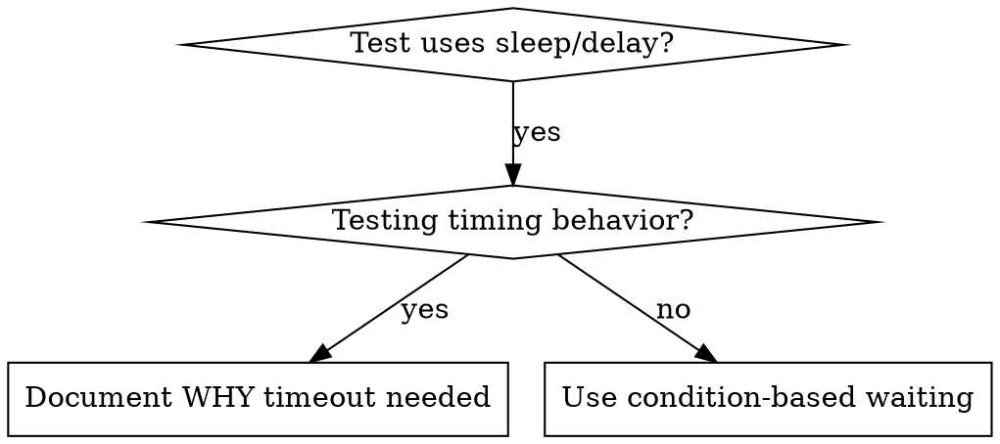

# Condition-Based Waiting

## Overview

Flaky tests often guess at timing with arbitrary delays. This creates race conditions where tests pass on fast machines but fail under load or in CI.

**Core principle:** Wait for the actual condition you care about, not a guess about how long it takes.

## When to Use



**Use when:**
- Tests have arbitrary delays (`time.sleep()`, `asyncio.sleep()`)
- Tests are flaky (pass sometimes, fail under load)
- Tests timeout when run in parallel
- Waiting for async operations to complete

**Don't use when:**
- Testing actual timing behavior (debounce, throttle intervals)
- Always document WHY if using arbitrary timeout

## Core Pattern

```python
# BEFORE: Guessing at timing
import time
time.sleep(0.5)
result = get_result()
assert result is not None

# AFTER: Waiting for condition
result = wait_for(lambda: get_result(), "result to be available")
assert result is not None
```

## Quick Patterns

| Scenario | Pattern |
|----------|---------|
| Wait for event | `wait_for(lambda: find_event(events, "DONE"))` |
| Wait for state | `wait_for(lambda: machine.state == "ready")` |
| Wait for count | `wait_for(lambda: len(items) >= 5)` |
| Wait for file | `wait_for(lambda: path.exists())` |
| Complex condition | `wait_for(lambda: obj.ready and obj.value > 10)` |

## Implementation

Generic polling function:

```python
import time
from typing import TypeVar, Callable, Optional

T = TypeVar("T")

def wait_for(
    condition: Callable[[], Optional[T]],
    description: str,
    timeout_s: float = 5.0,
    poll_interval_s: float = 0.01,
) -> T:
    """Wait for condition to return a truthy value."""
    start = time.monotonic()

    while True:
        result = condition()
        if result:
            return result

        elapsed = time.monotonic() - start
        if elapsed > timeout_s:
            raise TimeoutError(
                f"Timeout waiting for {description} after {timeout_s}s"
            )

        time.sleep(poll_interval_s)
```

## Common Mistakes

**Polling too fast:** `time.sleep(0.001)` — wastes CPU
**Fix:** Poll every 10ms (`0.01`)

**No timeout:** Loop forever if condition never met
**Fix:** Always include timeout with clear error

**Stale data:** Cache state before loop
**Fix:** Call getter inside loop for fresh data

## When Arbitrary Timeout IS Correct

```python
# Worker ticks every 100ms - need 2 ticks to verify partial output
wait_for(lambda: manager.started, "manager to start")  # First: wait for condition
time.sleep(0.2)  # Then: wait for timed behavior
# 200ms = 2 ticks at 100ms intervals - documented and justified
```

**Requirements:**
1. First wait for triggering condition
2. Based on known timing (not guessing)
3. Comment explaining WHY
