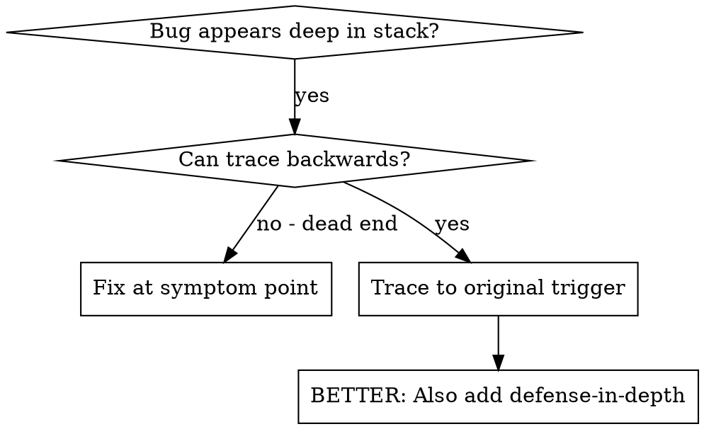
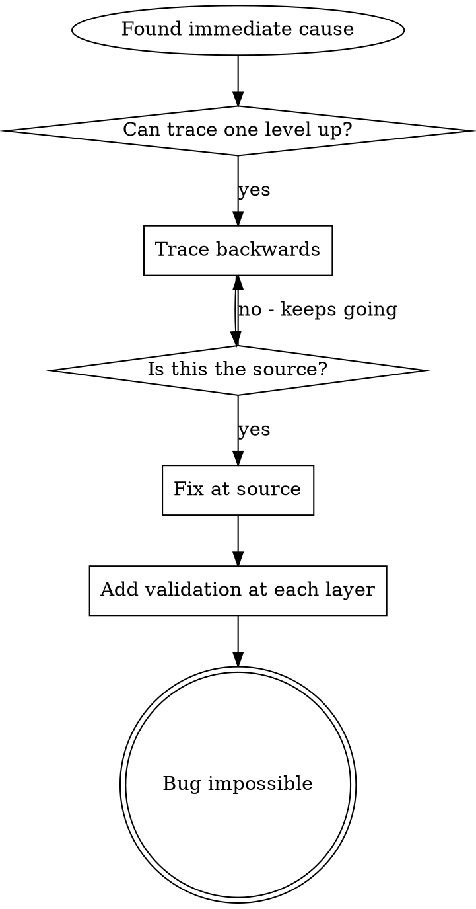

# Root Cause Tracing

## Overview

Bugs often manifest deep in the call stack (wrong file path, incorrect state, database opened with wrong parameters). Your instinct is to fix where the error appears, but that's treating a symptom.

**Core principle:** Trace backward through the call chain until you find the original trigger, then fix at the source.

## When to Use



**Use when:**
- Error happens deep in execution (not at entry point)
- Stack trace shows long call chain
- Unclear where invalid data originated
- Need to find which test/code triggers the problem

## The Tracing Process

### 1. Observe the Symptom
```
Error: FileNotFoundError: config.yaml not found in /Users/dev/project/src
```

### 2. Find Immediate Cause
**What code directly causes this?**
```python
config = yaml.safe_load(open(config_path / "config.yaml"))
```

### 3. Ask: What Called This?
```python
ConfigLoader.load(config_path)
  → called by App.initialize()
  → called by create_app()
  → called by test at test_app.py:42
```

### 4. Keep Tracing Up
**What value was passed?**
- `config_path = ""` (empty string!)
- Empty string resolves to current working directory
- That's the source code directory, not the config directory!

### 5. Find Original Trigger
**Where did empty string come from?**
```python
config_dir = os.environ.get("CONFIG_DIR", "")  # Missing env var!
app = create_app(config_dir)  # Passes empty string
```

## Adding Stack Traces

When you can't trace manually, add instrumentation:

```python
import traceback

def load_config(directory: str):
    stack = traceback.format_stack()
    print(f"DEBUG load_config: directory={directory!r}", file=sys.stderr)
    print(f"DEBUG stack:\n{''.join(stack)}", file=sys.stderr)

    config = yaml.safe_load(open(Path(directory) / "config.yaml"))
```

**Critical:** Use `print(..., file=sys.stderr)` in tests (logger may be suppressed)

**Run and capture:**
```bash
pytest tests/ 2>&1 | grep 'DEBUG load_config'
```

**Analyze stack traces:**
- Look for test file names
- Find the line number triggering the call
- Identify the pattern (same test? same parameter?)

## Key Principle



**NEVER fix just where the error appears.** Trace back to find the original trigger.

## Stack Trace Tips

**In tests:** Use `print(..., file=sys.stderr)` not logger — logger may be suppressed
**Before operation:** Log before the dangerous operation, not after it fails
**Include context:** Directory, cwd, environment variables, timestamps
**Capture stack:** `traceback.format_stack()` shows complete call chain
