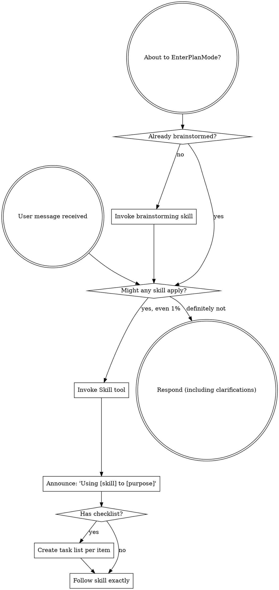

<EXTREMELY-IMPORTANT>
If you think there is even a 1% chance a skill might apply to what you are doing, you ABSOLUTELY MUST invoke the skill.

IF A SKILL APPLIES TO YOUR TASK, YOU DO NOT HAVE A CHOICE. YOU MUST USE IT.

This is not negotiable. This is not optional. You cannot rationalize your way out of this.
</EXTREMELY-IMPORTANT>

## How to Access Skills

**In Claude Code:** Use the `Skill` tool. When you invoke a skill, its content is loaded and presented to you — follow it directly. Never use the Read tool on skill files.

**In other environments:** Check your platform's documentation for how skills are loaded.

# Using Skills

## The Rule

**Invoke relevant or requested skills BEFORE any response or action.** Even a 1% chance a skill might apply means that you should invoke the skill to check. If an invoked skill turns out to be wrong for the situation, you don't need to use it.

## Red Flags

These thoughts mean STOP — you're rationalizing:

| Thought | Reality |
|---------|---------|
| "This is just a simple question" | Questions are tasks. Check for skills. |
| "I need more context first" | Skill check comes BEFORE clarifying questions. |
| "Let me explore the codebase first" | Skills tell you HOW to explore. Check first. |
| "I can check git/files quickly" | Files lack conversation context. Check for skills. |
| "Let me gather information first" | Skills tell you HOW to gather information. |
| "This doesn't need a formal skill" | If a skill exists, use it. |
| "I remember this skill" | Skills evolve. Read current version. |
| "This doesn't count as a task" | Action = task. Check for skills. |
| "The skill is overkill" | Simple things become complex. Use it. |
| "I'll just do this one thing first" | Check BEFORE doing anything. |
| "This feels productive" | Undisciplined action wastes time. Skills prevent this. |
| "I know what that means" | Knowing the concept ≠ using the skill. Invoke it. |

## Skill Priority

When multiple skills could apply, use this order:

1. **Process skills first** (brainstorming, debugging) — these determine HOW to approach the task
2. **Review/quality skills second** (pre-commit, deep-review) — these ensure quality
3. **Domain skills third** (framework-specific) — these guide specific implementation

"Let's build X" → brainstorming first, then implementation skills.
"Fix this bug" → systematic-debugging first, then domain-specific skills.
"Review this code" → pre-commit or deep-review.

## Skill Types

**Rigid** (TDD, debugging, verification): Follow exactly. Don't adapt away discipline.

**Flexible** (brainstorming, writing-plans): Adapt principles to context.

The skill itself tells you which.

## Available Skills

### Process Skills (Development Lifecycle)
| Skill | When to Use |
|-------|-------------|
| `requirements-framework:brainstorming` | Before any creative work — features, components, behavior changes |
| `requirements-framework:writing-plans` | After brainstorming, before implementation — create detailed plan |
| `requirements-framework:executing-plans` | When you have a plan to execute in batches with checkpoints |
| `requirements-framework:test-driven-development` | When implementing any feature or bugfix — write tests first |
| `requirements-framework:systematic-debugging` | When encountering any bug or unexpected behavior |
| `requirements-framework:verification-before-completion` | Before claiming work is complete or fixed |
| `requirements-framework:subagent-driven-development` | When executing plans with independent tasks via subagents |
| `requirements-framework:finishing-a-development-branch` | When implementation is complete, decide how to integrate |
| `requirements-framework:using-git-worktrees` | When starting isolated feature work |
| `requirements-framework:dispatching-parallel-agents` | When facing 2+ independent tasks |
| `requirements-framework:receiving-code-review` | When receiving feedback from reviewers |
| `requirements-framework:requesting-code-review` | When completing work and requesting review |
| `requirements-framework:writing-skills` | When creating or editing skills |

### Review Commands
| Command | Purpose |
|---------|---------|
| `/brainstorm` | Invoke brainstorming skill for design-first development |
| `/write-plan` | Create detailed implementation plan from requirements |
| `/execute-plan` | Execute plan with batch checkpoints |
| `/pre-commit` | Code review before committing |
| `/deep-review` | Cross-validated team-based review before PR |
| `/arch-review` | Architecture review with commit planning |

### Framework Skills
| Skill | When to Use |
|-------|-------------|
| `requirements-framework:requirements-framework-status` | Check framework status and configuration |
| `requirements-framework:requirements-framework-usage` | Learn how to use and configure the framework |
| `requirements-framework:requirements-framework-development` | Develop and contribute to the framework |
| `requirements-framework:requirements-framework-builder` | Extend the framework with new strategies |
| `requirements-framework:session-learning` | Review session and improve future sessions |

## Skills Auto-Satisfy Requirements

When a skill completes, it automatically satisfies its corresponding requirement:
- `brainstorming` → satisfies `design_approved`
- `writing-plans` → satisfies `plan_written` and `commit_plan`
- `test-driven-development` → satisfies `tdd_planned`
- `systematic-debugging` → satisfies `debugging_systematic`
- `verification-before-completion` → satisfies `verification_evidence`
- `requesting-code-review` → satisfies `pre_commit_review`

This means you don't need to manually run `req satisfy` — just use the skill and the requirement clears automatically.

## User Instructions

Instructions say WHAT, not HOW. "Add X" or "Fix Y" doesn't mean skip workflows.
